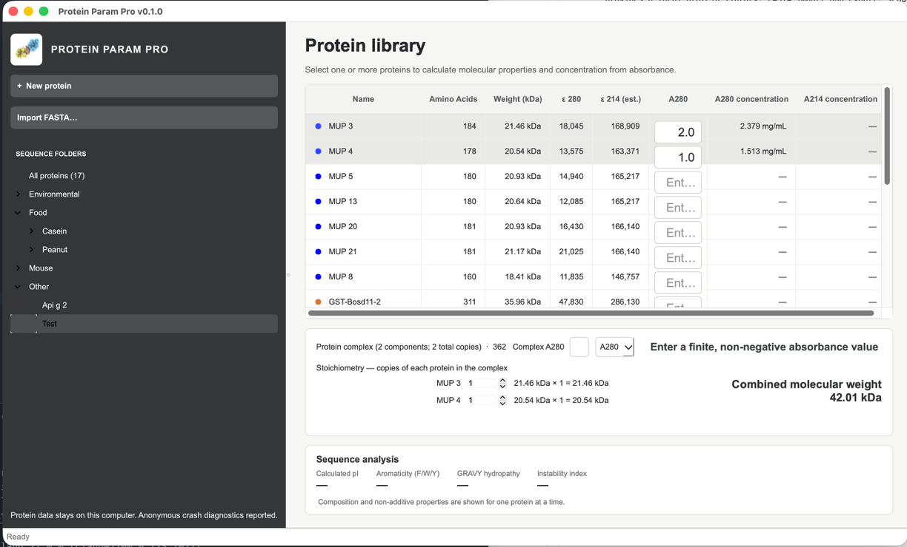

# Protein Param Pro

Protein Param Pro is a desktop application for organizing protein sequences and calculating commonly used molecular properties. It provides a local protein library, FASTA import and export, sequence-level analysis, and concentration estimates from absorbance measurements in a PySide6 interface.

## Features

- Store protein names, one-letter amino-acid sequences, folders, colors, and notes.
- Organize proteins in collapsible, nested folders and rearrange them with drag and drop.
- Import one or more sequences from `.fasta`, `.fa`, or `.faa` files.
- Export one protein, selected proteins, a folder, or the complete library as FASTA.
- Export calculated properties and library metadata as CSV.
- Calculate sequence length, molecular weight, and extinction coefficients at 280 nm and an estimated 214 nm.
- View calculated isoelectric point, aromaticity, GRAVY hydropathy, instability index, and the count and percentage of every standard amino acid.
- Estimate protein concentration in µM and mg/mL from an A280 or A214 measurement.
- Select multiple proteins to calculate the combined mass, extinction coefficient, and concentration of a 1:1 complex.

Protein Param Pro accepts the 20 standard one-letter amino-acid codes. Whitespace and `*` stop characters are removed automatically when a sequence is saved or imported.



## Using the application

Create a protein with **New protein**, or use **Import FASTA** to add several records at once. Select a folder in the sidebar to filter the table, and drag proteins or folders in the tree to reorganize the library.

Select a protein to see its sequence analysis. Double-click the analysis panel, or right-click a protein and choose **View sequence analysis**, for the complete amino-acid composition. Double-click a table row to edit its details and notes.

Enter each protein’s A280 in its table row; values are saved with the record. Selecting one protein shows its saved A280 and concentration below the table. With multiple proteins selected, enter a separate measured A280 in the lower calculator for the complex; this does not change the individual records or require saved row values. For A214, enter the absorbance in the lower calculator. Calculations assume a 1 cm path length. Use the stoichiometry spinboxes below the calculator to set the number of copies of each selected protein (default: one). The complex calculation weights the mass and extinction coefficient by these counts for both A280 and A214. Counts are retained while the app is open; individual protein records and their saved A280 values are unchanged.

Right-click proteins or folders for export, color, rename, and delete options. CSV export includes the sequence, notes, folder, calculated properties, and amino-acid composition.

## Installation from source

Protein Param Pro requires Python 3.14.5 or newer.

```bash
git clone https://github.com/gageoleighton/Protein-Param-Pro.git
cd Protein-Param-Pro
python3 -m venv .venv
source .venv/bin/activate
python -m pip install -r requirements.txt
python src/main.py
```

On Windows, activate the environment with `.venv\Scripts\activate` before running `python src/main.py`.

## Building the macOS application

The included PyInstaller specification builds the standalone macOS application bundle:

```bash
source .venv/bin/activate
pyinstaller ProteinParamPro.spec
```

The resulting application is written to `dist/ProteinParamPro.app`. The current specification targets the architecture of the Mac used for the build and does not configure code signing or notarization.

### Running an unsigned build

Because the application is not currently signed or notarized, macOS may report that it cannot verify or open the downloaded app. Only if you obtained the application from the GitHub Releases page, remove its quarantine attributes in Terminal:

```bash
xattr -cr "ProteinParamPro.app"
```

You should then be able to open Protein Param Pro normally. You may need to repeat this step after downloading a newer unsigned build.

## Data and privacy

The protein library and interface state are stored locally in `~/.protein_param_pro/`:

- `sequences.json` contains protein sequences and their associated metadata.
- `ui_state.json` remembers collapsed folders.

When a Sentry DSN is supplied in `sentry_config.json` or the `SENTRY_DSN` environment variable, the application sends crash diagnostics to help identify bugs. Error reporting disables default personally identifiable information, local-variable capture, and performance tracing. Remove the DSN or leave it unset to disable reporting. Protein library data is not uploaded as part of the application's normal operation.

## Calculation notes

- Molecular weight is calculated from the average residue masses plus one water molecule.
- The A280 extinction coefficient uses 5,500 M⁻¹ cm⁻¹ per tryptophan, 1,490 M⁻¹ cm⁻¹ per tyrosine, and 125 M⁻¹ cm⁻¹ per cysteine.
- The A214 extinction coefficient is an approximation of 923 M⁻¹ cm⁻¹ per peptide bond.
- Isoelectric point, aromaticity, GRAVY, and instability index calculations use [Biopython](https://biopython.org/).

These values are computational estimates and should be checked against an appropriate experimental method before critical use.

## Built with

- [Biopython](https://biopython.org/) for protein sequence analysis
- [PySide6](https://doc.qt.io/qtforpython-6/) for the desktop interface
- [PyInstaller](https://pyinstaller.org/) for application packaging
- [Sentry](https://sentry.io/) for error reporting

## Support

Report problems through the [GitHub issue tracker](https://github.com/gageoleighton/Protein-Param-Pro/issues) or contact Gage O. Leighton, PhD at gageoleighton at gmail.com.
